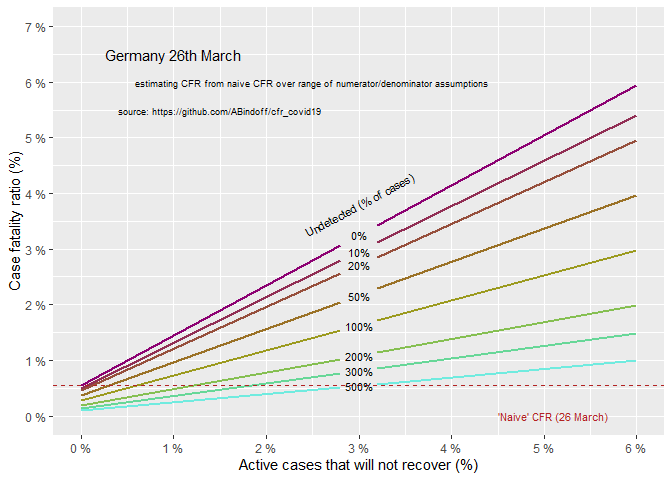

Errors in calculating CFR for COVID-19 - Germany (DE)
================
Bindoff, A.
26/03/2020

The case fatality rate (CFR) *during* an epidemic is known to be
inaccurate because (a) the true number of cases is unknown, and (b) many
cases are still active and a proportion of those may die. We refer to
the statistic often cited as the CFR for COVID-19 at present as the
‘naive’ CFR reflecting that it is an unsophisticated estimate of the
true CFR, which can be defined by the equation,

\[\widehat{CFR} = \frac{deaths + \omega(active \ cases)}{total \ cases}\]

where \(\omega \in [0,1]\) is the (unknown) proportion of active cases
which will resolve by death (a **numerator** error). At the end of the
epidemic, the number of active cases becomes zero and we are left with
\(\frac{deaths}{(deaths + recoveries)}\).

In addition, because the number of undetected cases is unknown we have a
**denominator** error. This has been widely reported, but without much
regard for the relationship between numerator and denominator errors. At
this stage we don’t know what the magnitude of the likely numerator or
denominator errors are, although the proportion of active cases which
will not recover is probably smaller than the naive CFR because time to
death is less than time to recovery. It is possible, contrary to popular
opinion, that naive CFR may in fact *underestimate* CFR for COVID-19,
and in this vignette we investigate a plausible range of scenarios.

Our model of CFR is,

\[\widehat{CFR} = \frac{deaths + \omega(active \ cases)}{total \ cases \ detected + \rho(total \ cases \ detected)}\]

where \(\rho \geq 0\) is the proportion of total cases that are assumed
to be undetected at the current time and \(\omega \in [0,1]\) is the
proportion of active (and detected) cases at the current time that will
not recover (making the simplifying, conservative assumption that
because the undetected cases are asymptomatic or mild, the patient is
unlikely to die).

We will use total cases, recoveries, and deaths as of 26th March 2020
for **Germany** to provide context. These data are simply transcribed
from <https://www.worldometers.info/coronavirus/> (accessed 13:04PM AEST
26-3-20). For simplicity we will not consider conditional estimates of
CFR (age, comorbidity, or the capacity of different regions to respond
with life-saving acute care).

``` r
cfr <- function(w_hat, deaths, recoveries, active_cases, p_uncounted = 0){
  (deaths + w_hat*active_cases)/((deaths + recoveries + active_cases) + (p_uncounted*(deaths + recoveries + active_cases)))
}
```

``` r
# total cases 17/3/20 = 7272
# active cases = 7188

d <- expand.grid(w_hat = c(0, .028, .03, .032, .06),
                 active_cases = 33570,
                 deaths = 206,
                 recoveries = 3547,
                 p_uncounted = c(0, .10, .2, .50, 1, 2, 3, 5))


d$cfr <- cfr(w_hat = d$w_hat,
             active_cases = d$active_cases,
             deaths = d$deaths, 
             recoveries = d$recoveries,
             p_uncounted = d$p_uncounted)
```

``` r
d$cfr0 <- d$cfr
d$cfr[d$w_hat ==.03] <- NA

crude_cfr <- 206/37323
```

<!-- -->
